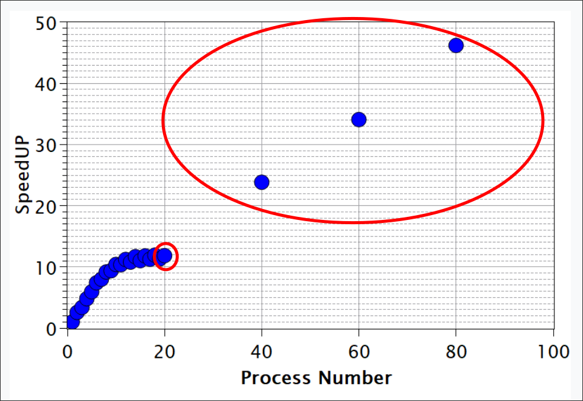

# Assignment 1

## Part 1
Solution provided in code and can be found in the zip file.

## Part 2
The appropriate data points are circled in red and in the range between 1 to 20 processes. These points show the expected near-linear scaling, where the speedup increases almost proportionally to the number of processes. Furthermore, the socket has 20 cores, which use very fast communication inside the socket, hence have minimal communication overhead.

On the otherhand, increasing the number of processes beyond 20 we would need to add additional nodes, which would introduce significant network communication overhead, which are not present in the plot. It would be impossible to observe this linear scaling in the results, after exceeding 20 processes.

{ width=80% }

### Serial fraction
Using Amdahl's law we can compute the serial fraction by using the speedup value at $p=20$ processes, which is $S = 12$ according to the provided plot. The serial fraction is derived as follows:

\begin{align}
S(p) &= \frac{1}{s + \frac{1-s}{p}} \\
12 &= \frac{1}{s + \frac{1-s}{20}} \\
s + \frac{1-s}{20} &= \frac{1}{12}\\
19s + 1 &= \frac{5}{3} \\
19s &= \frac{5}{3} - 1 = \frac{5 - 3}{3} = \frac{2}{3} \\
s &= \frac{2}{3 \cdot 19} = \frac{2}{57} \approx 0.035 \text{ or } 3.5\%
\end{align}

Therefore 3.5% of the code is serial.

