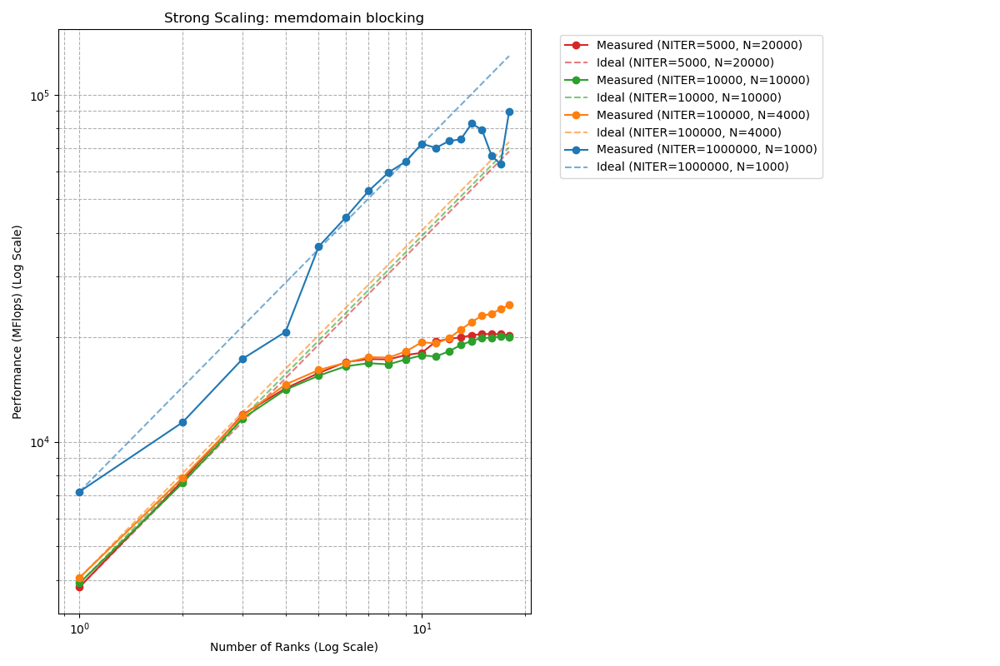
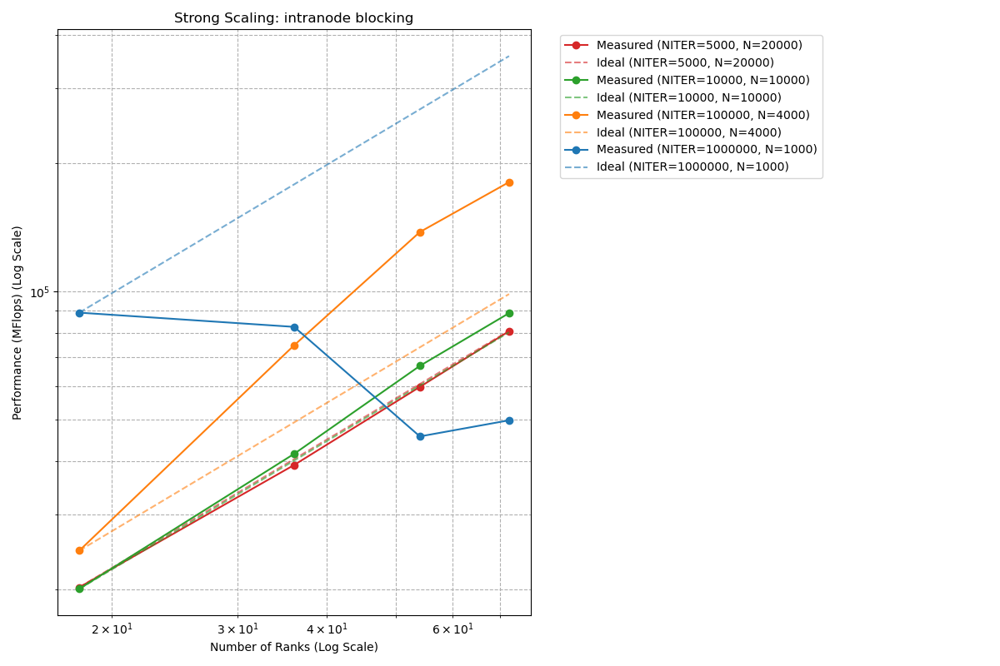
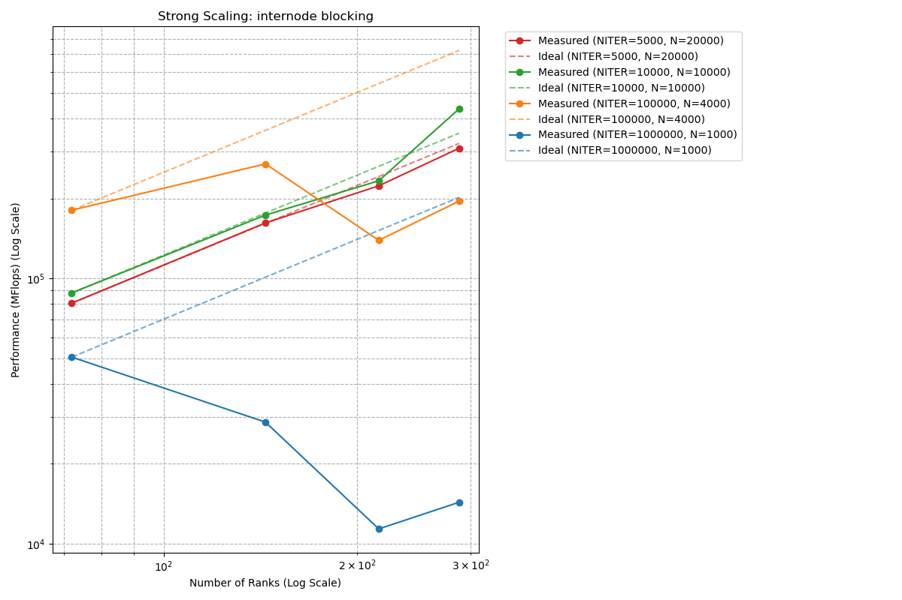
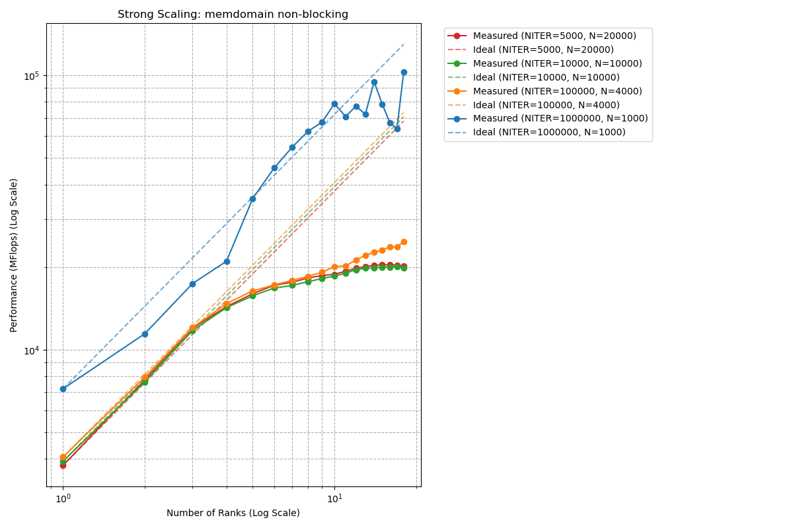
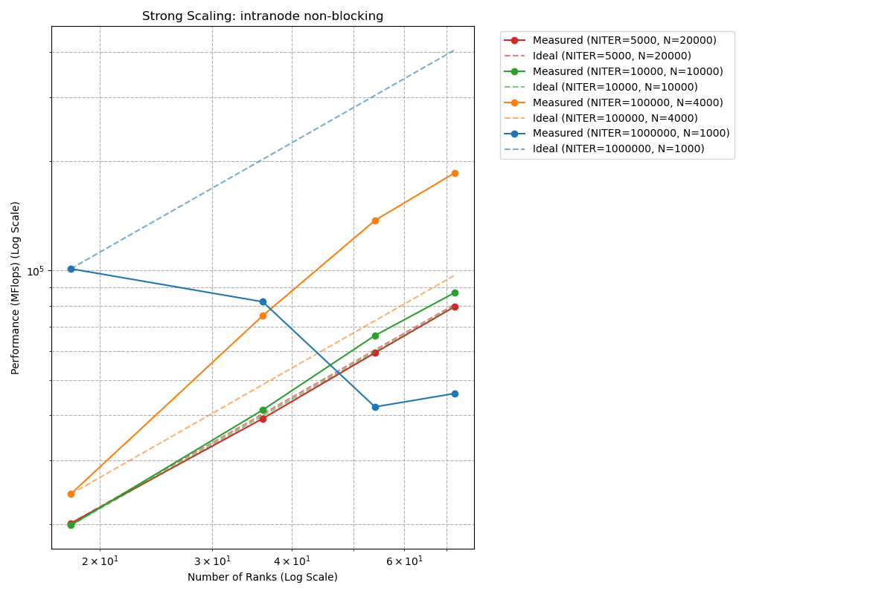
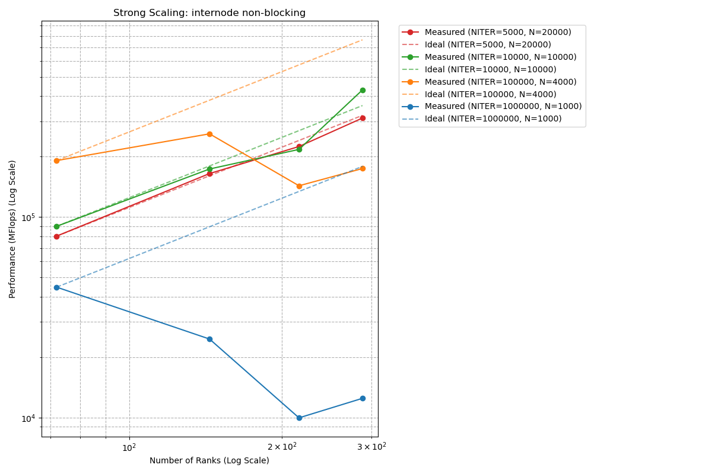

# Assignment 3 (DMVM)
In the `dmvm.c` file you can find `#define` macros to select blocking or non-blocking communication, as well as actvating the check for the dmvm.

## Blocking Communication
The strong scaling results shown below, examine DMVM performance across three communication scenarios: memory domain (shared memory), intranode (within a single node), and internode (across multiple nodes), each with its own performance characteristics and bottlenecks. In this first part a Blocking MPI communication chemes was used (`MPI_Sendrecv`)

{ width=80% }

The memory domain configuration shows almost ideal scaling up until in the area of 64 processes. If we have a look at larger problem sizes (100000) appear to not saturate as fast in comparison to smaller, due to increased ratio between computation and communication. Furthemore the the observed communication degredation north of 100 processes is due to the fact that overhead starts to dominate for this implementation.

{ width=80% }

Intranode configuration shows fascinating cache effects and behavior for different problem sizes. Especially, the orange series (NITER=100000, N=4000) presents super-linear speedup. The reason for that is thot the problem is divided across more processes, each processes' workload fits better and better into cache, and the data in the cache is reused extensively. On the other hand of the spectrum the blue series (NITER=1000000, N=1000) demonstrates severe anti-scaling, with performance actually degrading rapidly. Because beyond 18 processes the problem is simply too small and communication dominates. 

{ width=80% }

The Internode communication scenario introduces new network latency and bandwidth constraints due to the pysically being multiple nodes, which significantly impacts scaling behavior. The curves are flatter than in the previous two examples, indicating that inter-node communication becomes a primary bottleneck. While larger problem sizes (orange and green) are able to sustain reasonable scaling efficiency, the smallest problem (blue) shows very bad performance degradation with increasing number of processes. This becomes particularly noticable at higher number of processes, where communication volume increases relative to local computation. In comparison to the intranode scenario,  no super-linear scaling can be observed, because the  network communication costs cannot be offset by cache benefits across nodes.

## Non-Blocking Communication
The Goal of Non-blocking MPI communication (MPI_Isend/MPI_Irecv with MPI_Waitall) is  to overlap communication with computation with the intention of hiding communication latency by performing work during communication.

{ width=80% }

The non-blocking implementation shows nearly identical performance characteristics to the blocking variant. In this scenario the overlap potential of non-blocking communication provides a negligible benefit in shared memory configurations. The reason for this is that the communication latency is already minimal. This leads to the conclusion that for DMVM on a memory domain, non-blocking communication does not give any significant benefit.

{ width=80% }

Similar to the previous scenario Intranode with non-blocking communiction resembles also very closely to the blocking case, including the previously observed super-linear scaling and anti-scaling. This suggests that the algorithm lacks sufficient independent computation to overlap with communication, or synchronization points (MPI_Waitall) occur too soon after communication initiation or intra-node communication is fast enough that overlap provides minimal benefit. 

{ width=80% }

The story repeat itself here for the internode non-blocking scaling. Eventhough, there more potential for better performance due to the overlap which could hide the higher latency, the result look very similar, leading us to the same conclusion as the two previous scenarios.
