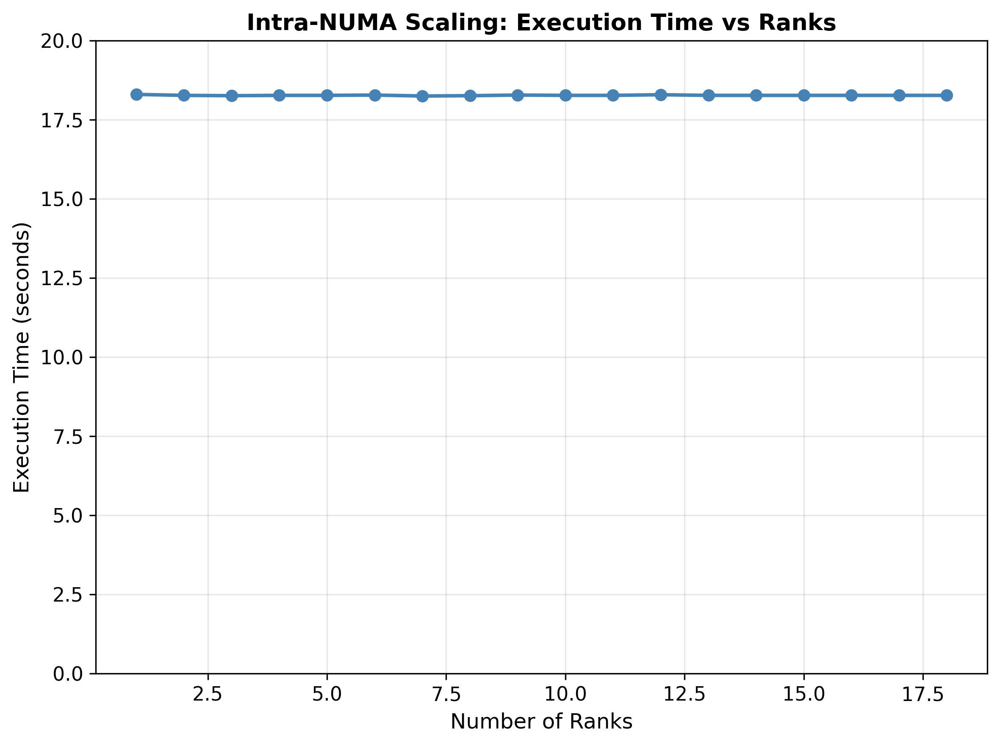
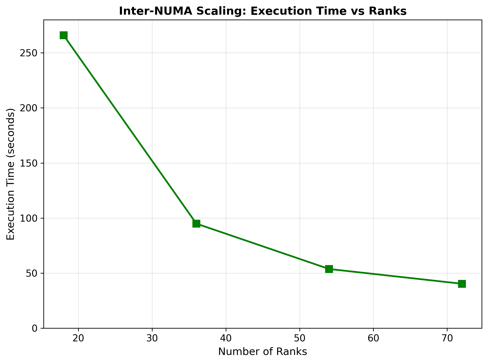
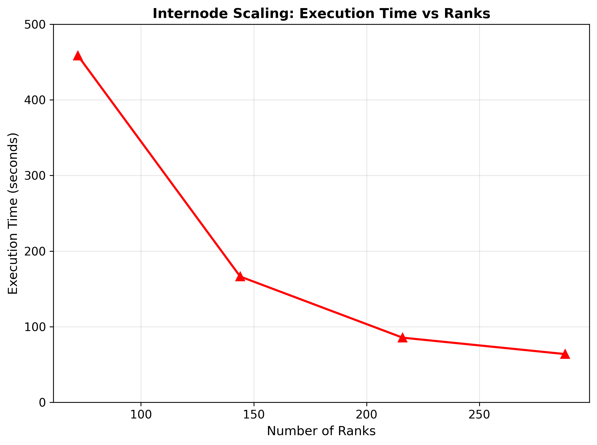
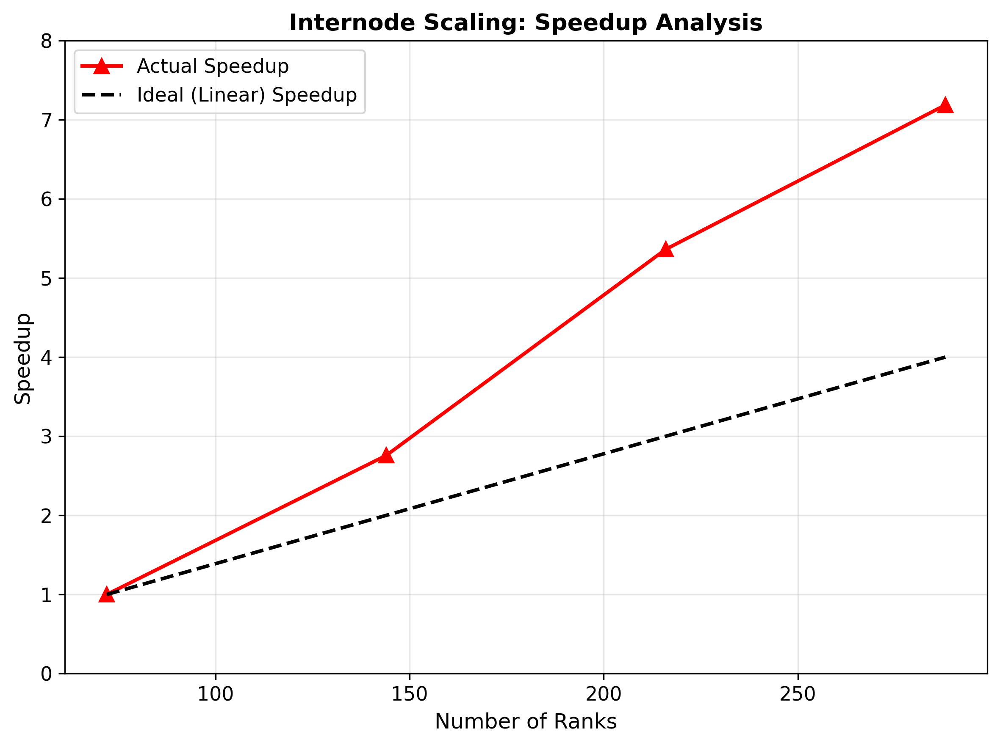

# Assignment 07 (MPI Benchmarking 3D MPI Solver)

## 1. Intra-NUMA Scaling (1-18 ranks, 200×40×40 domain)

### Results

- Execution time remains essentially constant across all rank counts:
- Mean: 18.272s
- Standard deviation: 0.011s  
- Range: 18.25s to 18.30s

### Analysis
- No speedup was observed, which indicates this configuration is memory-bound.
- This is due to the Problem size being too small.
- All ranks compete for shared NUMA memory bandwidth.
- Small domains for each process increase communication-to-computation ratio
- This leads to Memory access dominating over computation time.

## 2. Inter-NUMA Scaling (18-72 ranks, 300×150×150 domain)

### Results

| Ranks | Time (s) | Speedup |
|-------|----------|---------|
| 18    | 265.93   | 1.00×   |
| 36    | 94.93    | 2.80×   |
| 54    | 53.75    | 4.95×   |
| 72    | 40.36    | 6.59×   |

### Analysis
- The plot show the Super-linear scaling with peak efficiency up to 164.9%.
- Larger problems  (6.75M cells, ~93.8K cells/rank) provides in this configuration sufficient work.
- The workload fits  better into cache and therefore  reduces memory latency.
- Application now exhibits compute-bound behavior.
- Communication overhead is now reduced compared to the intranode numa case.

## 3. Internode Scaling (72-288 ranks, 600×200×200 domain)

### Results

| Ranks | Nodes | Time (s) | Speedup | 
|-------|-------|----------|---------|
| 72    | 1     | 458.71   | 1.00×   | 
| 144   | 2     | 166.34   | 2.76×   | 
| 216   | 3     | 85.53    | 5.36×   | 
| 288   | 4     | 63.83    | 7.19×   | 

### Analysis
- Here we can observer even stronger super-linear scaling with peak efficiency of up to almost 180%.
- Even large problem (24M cells, ~83.3K cells/rank) has an optimizes cache utilization.
- Each of the four nodes can provide independent memory subsystem.
- Shows a good balance between local domain size and parallelism.
- This clearly exhibits a  strongly compute-bound
- Network communication overhead appears to be negligible.
